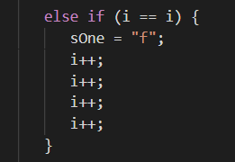
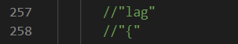
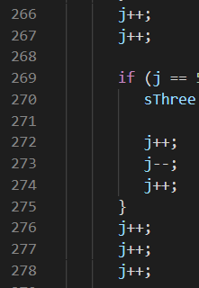
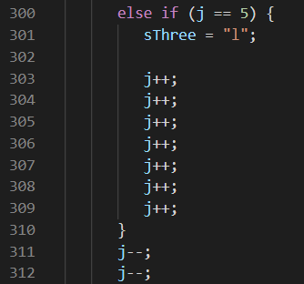
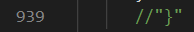

# Munch Munch

File: 

Question: 
            K: Yo why doesn't this work?
            Me: See code
            Me: Pain use loop
            K: If statements are loops
            Me: Pain

Hint: Include Comments

## Website 
When you look at the program you fist see two ints and three strings that are instantiated, and as you scroll down, you see that these variables are being changed. So, you want to keep track of what the variables are and when they are "called."

For int i, you will notice that the variable i is not changed at all, but as you scroll you will see that only one of the lines have i == i. This line will change sOne to f.

As you finish scrolling throught the i's, you will see two commented lines (257 and 258) "//lag and //{." You want to keep track of those numbes 

After you will see multiple lines of j++ and j--. 

Using those, keep track of the value of j. So, wherever j and the number being compared to that or j and j are equal to each other, write down the character/symbol/number (depending on what it asks you to give) associated with it.

(Lines 300 to 312)

Continue to do this until you reach the last curly brace as shown below:

Once you reach that, you shold write that down to close the flag off and get the flag, flag{lots_0f_ifs}.