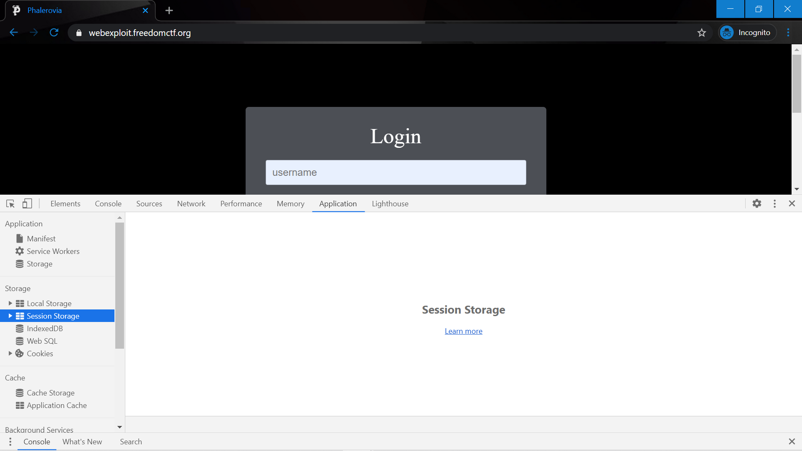
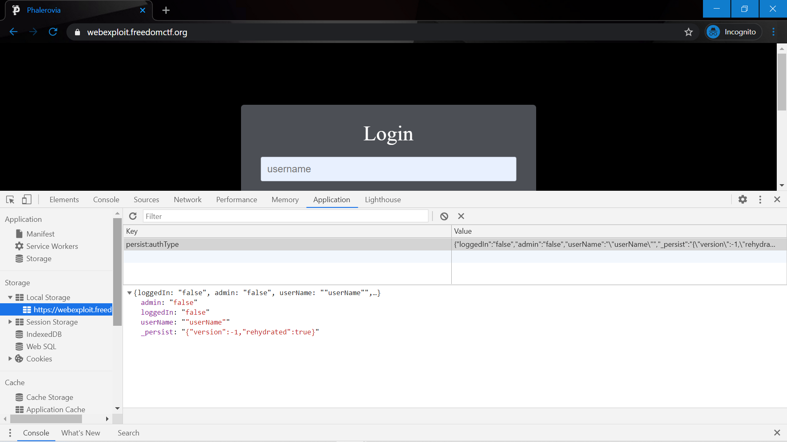
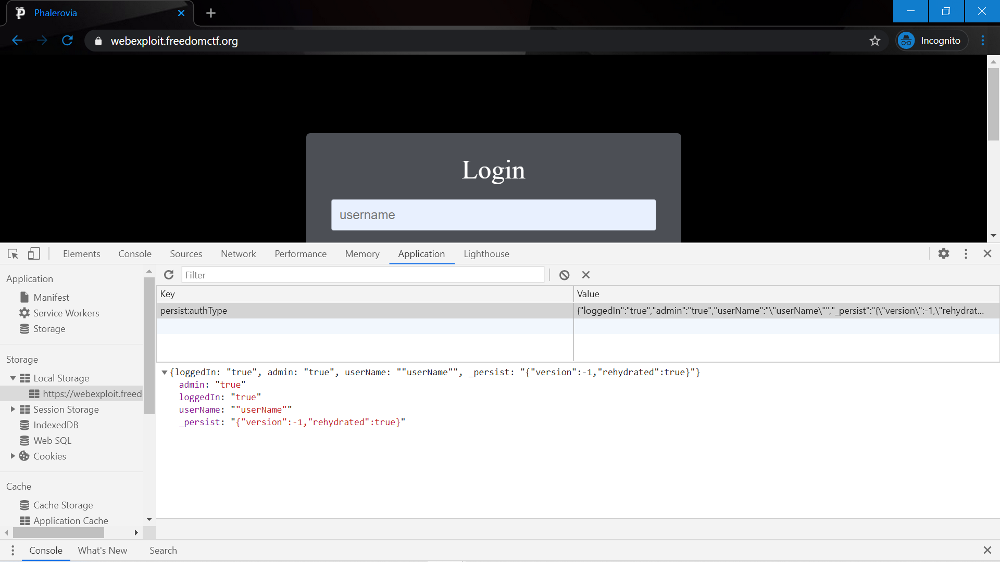
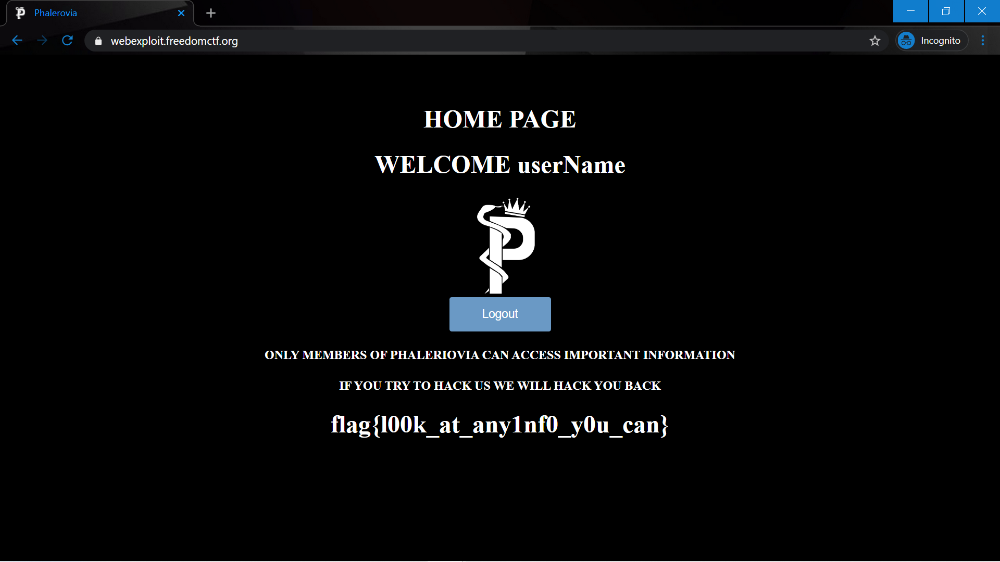

# Munch Munch

Website: https://webexploit.freedomctf.org

Question: The company doesn’t have good session management system in place, try to exploit that to find the flag.

Hint: what do people use for session management?

## Website 
Once you Inpsect Element, click on the "Application" tab.

Then go to Local Storage on the Left and Click on that. After that, click on https://webexploit.freedomctf.org.

Change the false infront of admin and loggedIn from "false" to "true" in the Value box on the right.

Refresh the page and then the flag will be returned, flag{l00k_at_any1nf0_y0u_can}.

