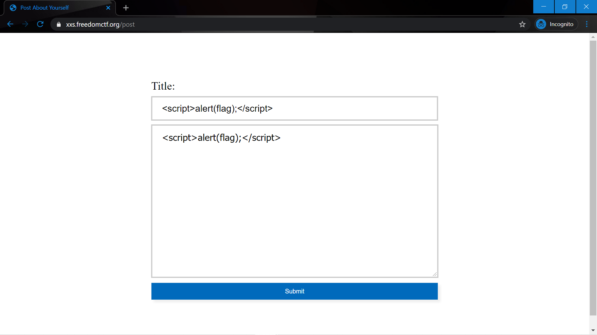
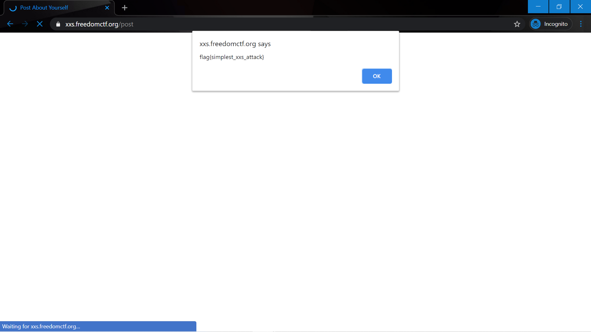

# Run Script Run

Website: https://xxs.freedomctf.org/

Question: There are some JavaScript bugs here. My source says it’s some kind of ssx attack or something I don’t remember. Can you help me find a secret hidden information?

Hint: cross site scripting

## Website 
Once you type the website in, you type "" in for the title and description.

Then you will see that an alert pops up saying the flag, flag{simplest_xxs_attack}.

