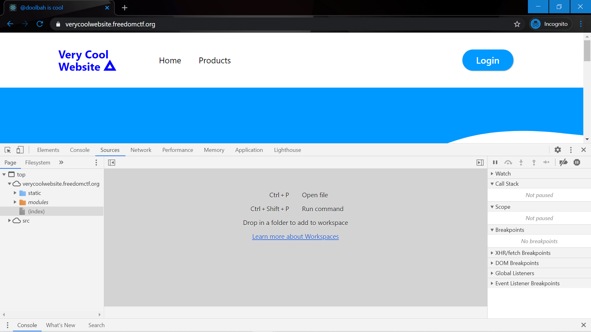
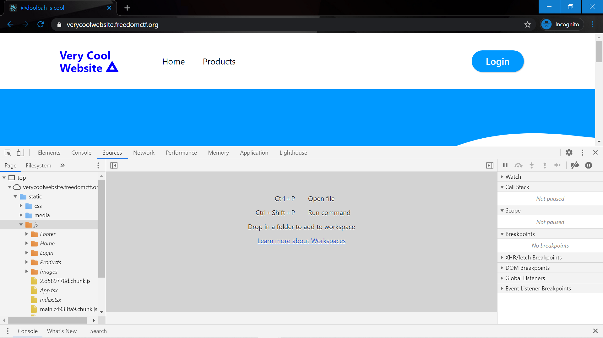
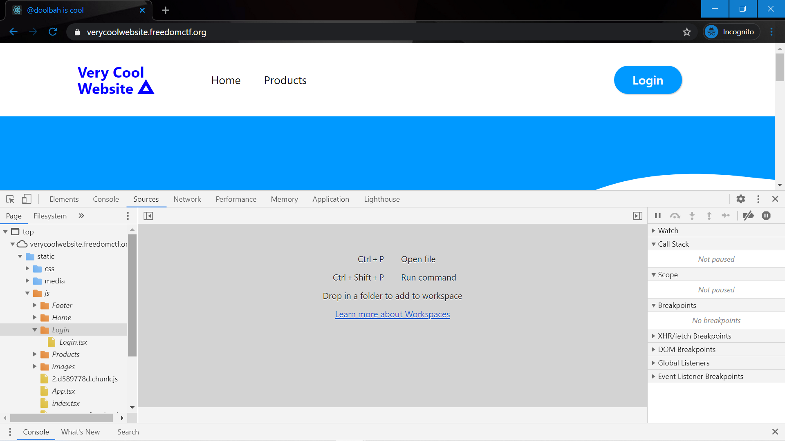
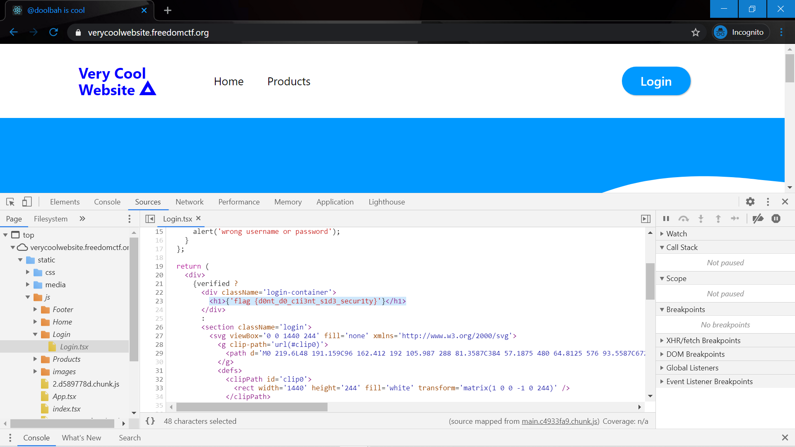

# Sloppy Auth

Website: https://verycoolwebsite.freedomctf.org/

Question: I don’t know what the company is thinking but their authentication is on the client side. Can you figure out a way to login?

Hint: None

## Website 
Once you Inpsect Element, click on the "Sources" tab.

Then go to the Static and then js folders.

Click on the Login folder then open Login.tsx

Scroll down to line 23 and the flag is there, flag {d0nt_d0_c1i3nt_s1d3_secur1ty}.

