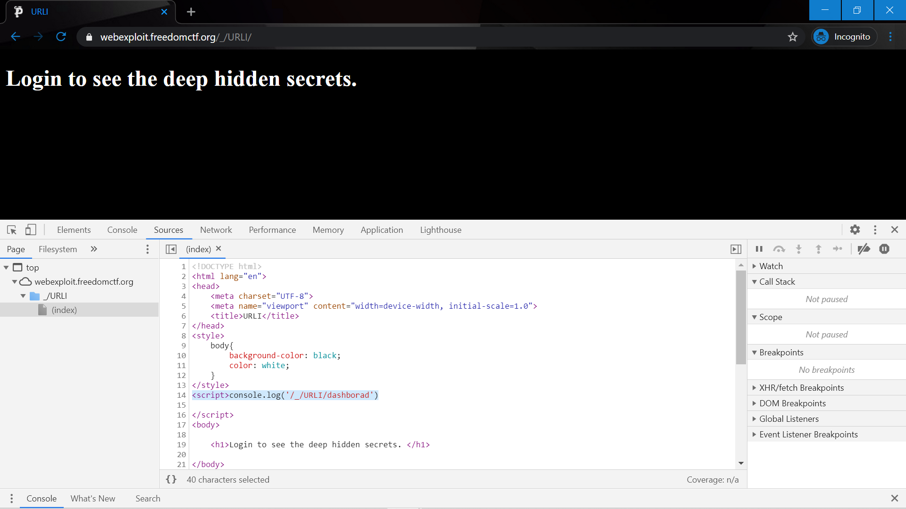
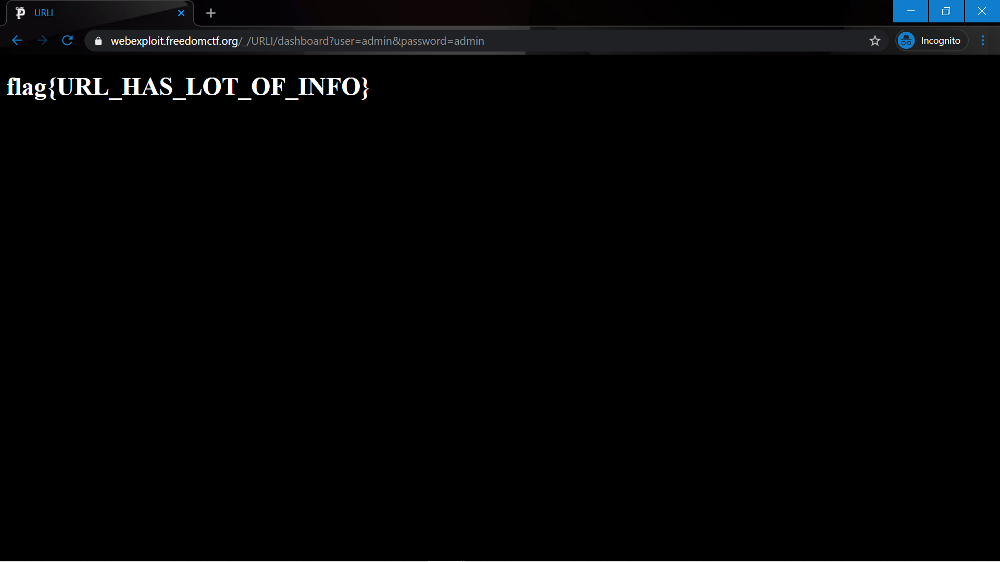

# Weird Auth

Website: https://webexploit.freedomctf.org/_/URLI/

Question: I see some URLs logged on the console but don’t know how they are performing the authentication. I heard some people use the URL authentication to hide forms.

Hint: HTTP Get Request

## Website
Once you Inpsect Element, click on the "Sources" tab, and there you will see on line 14 it says, "."

Type that into the URL.

Then you will see it says, "Sorry only authorized users are allowed." So change the URL to say https://webexploit.freedomctf.org/_/URLI/dashboard?user=admin&password=admin. It will then return the flag, flag{URL_HAS_LOT_OF_INFO}.

